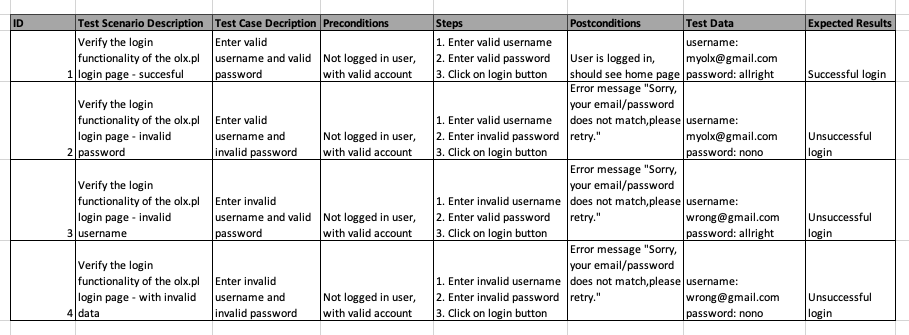
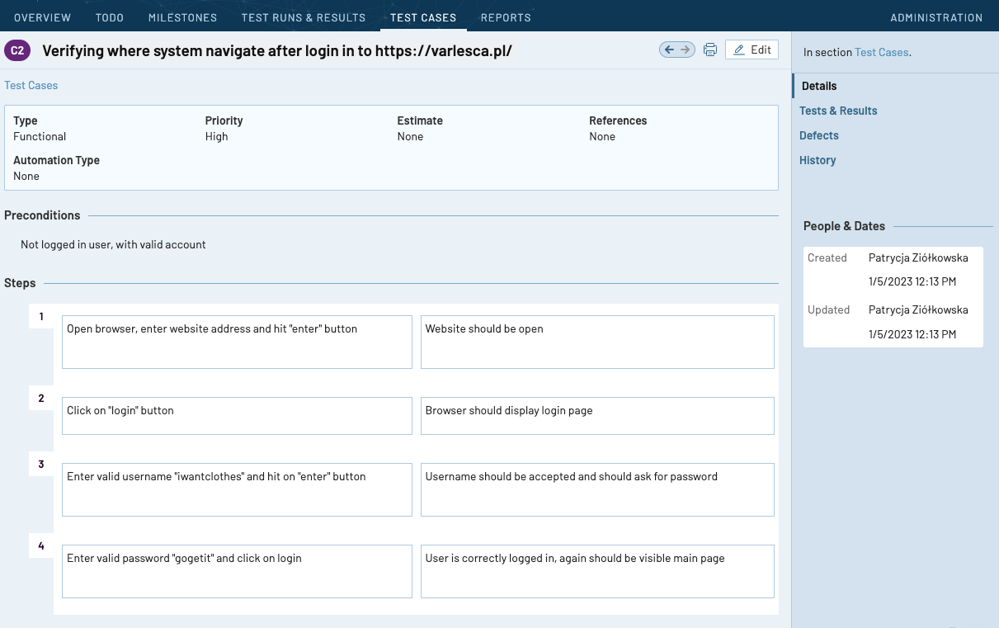

## AboutMe

My name is Patrycja Ziółkowska, and I am a student at Postgraduate Studies in Software Testing, currently I am ready to join a QA team. 
 
I know the Software Development Life Cycle, I understand differences between Scrum and Kanban. 
I have knowledge of types of tests and software testing techniques. 

Additionally I made few courses, to develop new skills - Jira, SQL. At school we learnt Linux, so working with terminal isn't something new for me. I am familiar with tools like TestRail, Github, Gitlab.

I have a bachelor's degree in English studies, and I am using English daily, so I can easily communicate and write.

Best regards!
	
## Studies

* Wyższa Szkoła Bankowa w Chorzowie - Postgraduate Degree, Software tester for mobile and server applications
* Wyższa Szkoła Filologiczna we Wrocławiu - Bachelor's degree, English philology

## Finished courses

* Git For Beginners / Udemy
* JIRA Beginner - Project Management / Udemy
* SQL for Beginners: Learn SQL using MySQL and Database Design / Udemy

## Courses in progress

* Cypress: Automation Testing from Zero to Hero

## Skills

* Creating test cases and scenarios
* Reporting bugs
* SQL
* Jira
* TestRail
* Git

## My test cases&bug reports

* Test Scenario

* My Test Case made in TestRail QA tool

