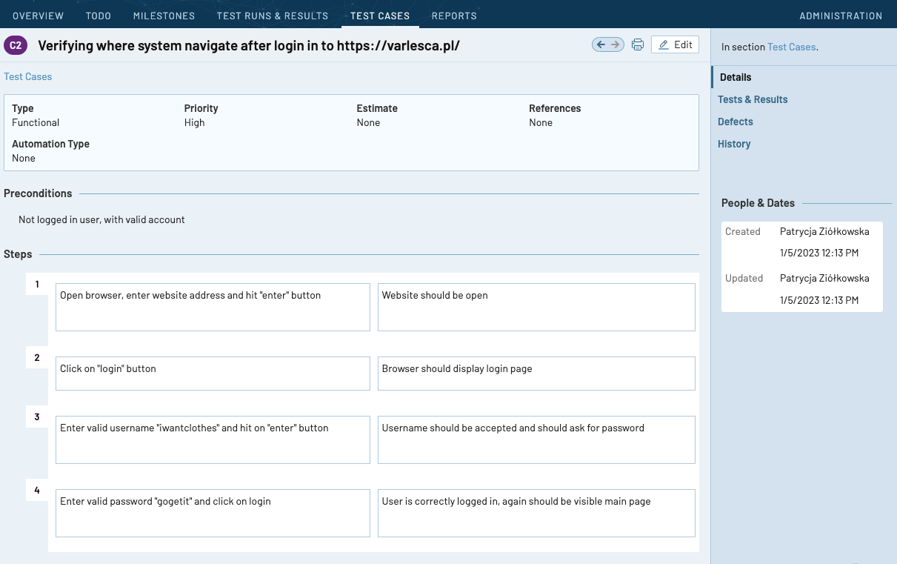
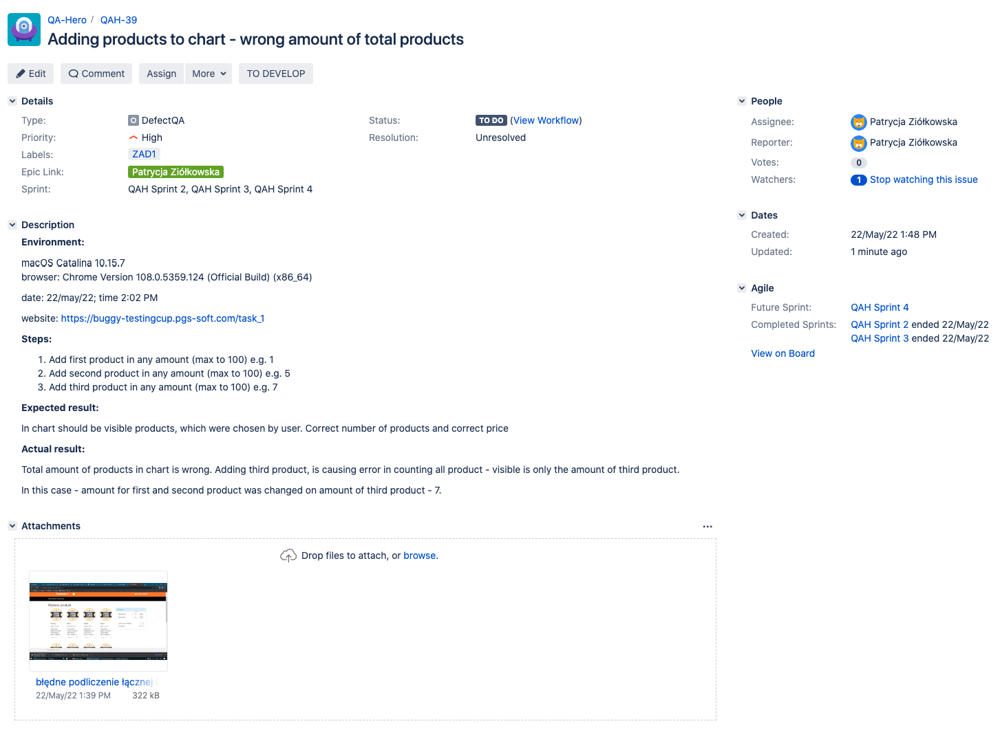

## AboutMe

Hi! 

My name is Patrycja Ziółkowska, and I am a student at Postgraduate Studies in Software Testing, currently I am ready to join a QA team. 
 
I have really good testing knowledge (testing techniques and life cycle, I know creating rules for test cases and reports, i am familiar with tools:GIT, SQL(I really like it), TestRailQA, Jira), so it is a perfect time to start a job. :) 

I am ready to work as manual tester, but I am also interested in automation testing, I am constantly learning it at school, and by myself, right now Python - my new love :)

I have a bachelor's degree in English studies, and I am using English daily, so I can easily communicate and write.

Best regards!
	
## Studies

* Wyższa Szkoła Bankowa w Chorzowie - Postgraduate Degree, Software tester for mobile and server applications
* Wyższa Szkoła Filologiczna we Wrocławiu - Bachelor's degree, English philology

## Finished courses

* Git For Beginners / Udemy
* JIRA Beginner - Project Management / Udemy
* SQL for Beginners: Learn SQL using MySQL and Database Design / Udemy
* ISTQB Foundation Level / Syllabus and book
* Python for Absolute Beginners / Udemy

## Skills

* Creating test cases and scenarios
* Reporting bugs
* Knowledge of testing methods and software design
* Pay attention to detail
* Analytical mind

## My test case made in TestRailQA tool

## My bug report made in Jira tool

