## AboutMe

Hi!

I'm Patrycja Ziółkowska, a software tester with a passion for quality. I have experience in testing mobile, web, desktop applications and production systems. I am familiar with a variety of testing tools, and I can communicate effectively with both technical and non-technical audiences. I am a hard worker with a strong attention to detail, and I am always willing to go the extra mile. I am also a team player and I am always looking for ways to help others.

I am looking for a challenging and rewarding role in software testing where I can use my skills and experience to make a real difference. I am confident that I can make a significant contribution to your team and help you to deliver high-quality software.

Here are some of my additional skills and experience:

* I have performed application audits, analysis, and mockup evaluations.
* I write test cases and test scenarios.
* I started to write first postman requests 
* I am motivated and always looking for ways to improve my skills.
* I am a team player and always willing to help others.
* I am open to new challenges and always looking for ways to grow.
* I have knowledge of SQL and Python.
* I am also a highly independent worker who is able to work effectively on my own. 

Best regards!
	
## Studies

* Uniwersytet WSB Merito Wrocław - Postgraduate Degree, Programista Front-End z Angular - 2024
* Wyższa Szkoła Bankowa w Chorzowie - Postgraduate Degree, Software tester for mobile and server applications - 2023
* Wyższa Szkoła Filologiczna we Wrocławiu - Bachelor's degree, English philology

## Finished courses

* Git For Beginners / Udemy
* JIRA Beginner - Project Management / Udemy
* Postman
* ISTQB Foundation Level / Syllabus and book
* Python for Absolute Beginners / Udemy
* Java Script

## Skills

* Mobile, web, and desktop application testing
* Knowledge of Postman
* Application audits, analysis, and mockup evaluations
* Test case and test scenario writing
* Reporting bugs
* Knowledge of testing methods and software design
* Pay attention to detail
* Analytical mind

## My test cases

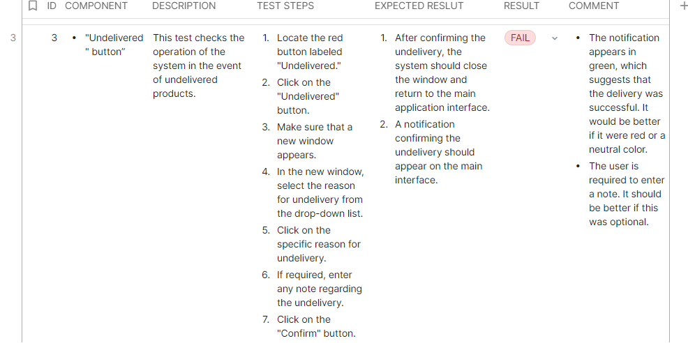

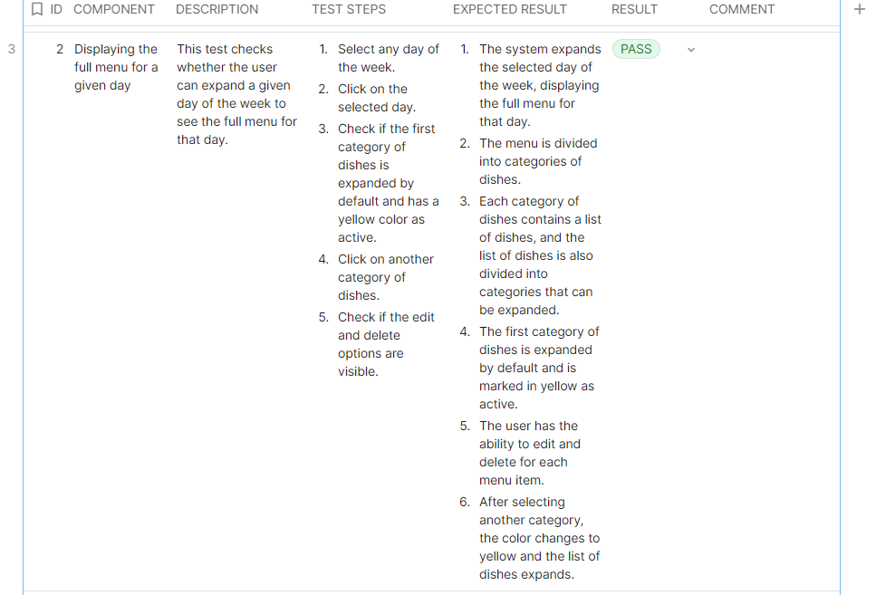

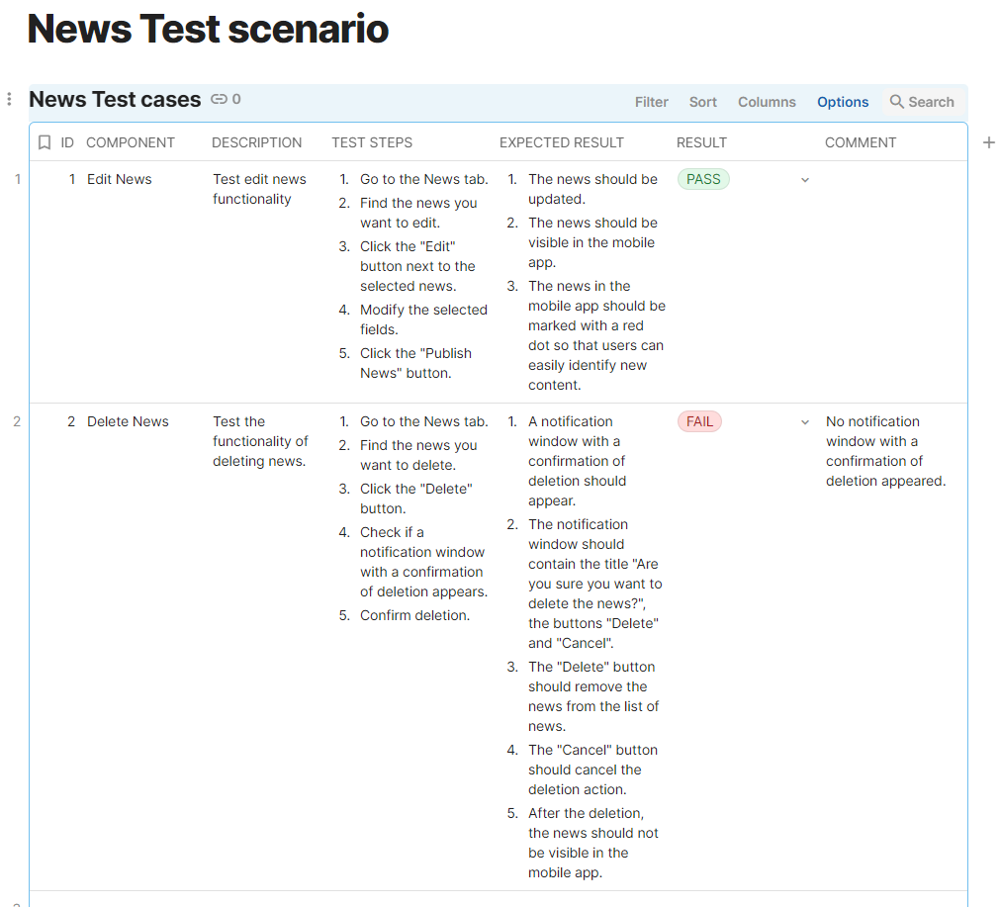

## My Postman

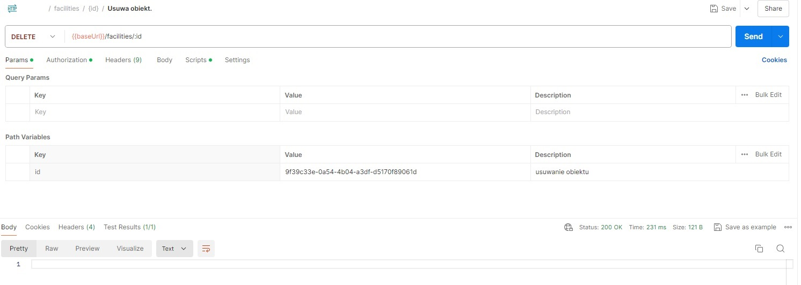

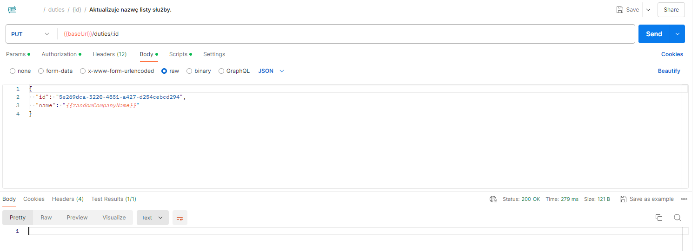

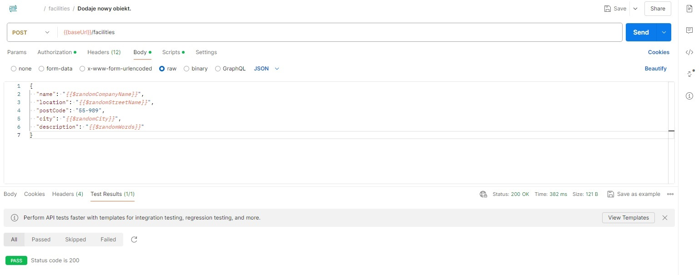

## My bug report made in Jira tool

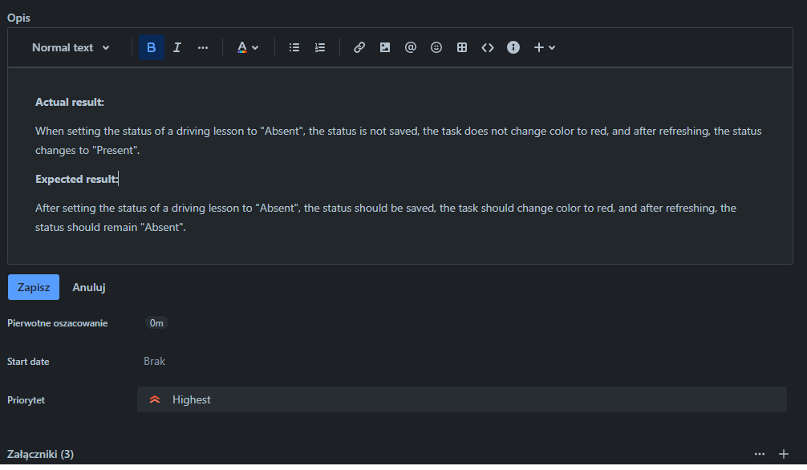

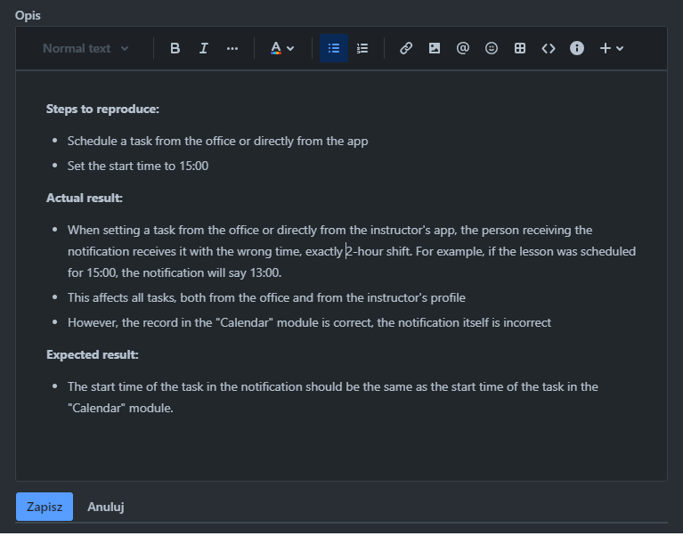

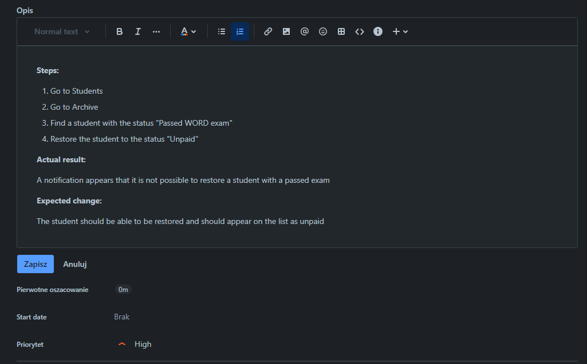

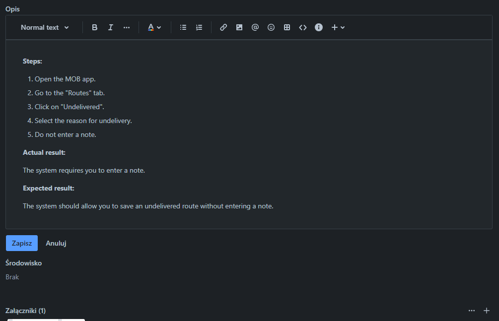

## Audit report

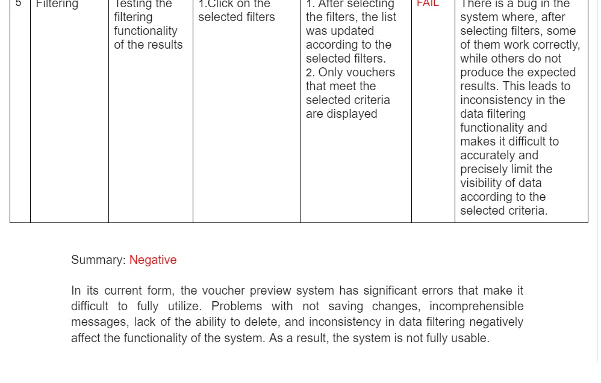

